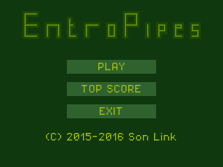

# EntroPipes

https://son-link.itch.io/entropipes

© 2015 - 2017 Alfonso Saavedra "Son Link"

http://son-link.github.io

EntroPipes is a puzzle type game programing on [LUA](http://lua.org) and the framework [LÖVE](http://love2D.org) for **Linux**, **Windows**, **Android** and Web Browsers.

Under **GPL 3** license

Based on original idea of [Z80St Software](https://sites.google.com/site/z80stsoftware)

## Installation:
Simply download the correct archive for your system, extract and double click on the executable.

## Download:
[Last releases](https://github.com/son-link/EntroPipes/releases)

## How to play:

In the main menu select option using **Up/Down** keys (default **Up/Down arrows** on your keyboard), and **Left/Right** (default **Left/Right arrows** on your keyboard for select puzzle size. In game is used for move the cursor.

Press **A** button (**Z** in keyboard) in the main menu for . In game rotate the selected pipe.

In game press **X** button (**A** in keyboard) for pause/play game

Press **Scape** on Linux/Windows or **Back button** on Android to show pause menu on game or resolve puzlle. On main menu exit directly. On anoher options return to main menu.

The game will automatically pause when it loses focus (changed window or app) or is minimized.

## Captures:
### Main Screen:

### In game video:

## Puzzle editor:

The puzzle editor is write on HTML and Javascript and based on the original puzzle ediotor make by Z80St. Simply open **editor.html** on your favorite web browser (tested on **Firefox** and **Chrome**) or use the online versions avaliable on my [blog](http://son-link.github.io/entropipes_editor/) and send to my email account, create a new issue or send push merge.

## Other credits:

[TIC-80](https://github.com/nesbox/TIC-80) is a fantasy computer for making, playing and sharing tiny games

TIC-80 is under the MIT license. (C) 2017 Nesbox

Font icon for the editor make with [Fontello](http://fontello.com)
