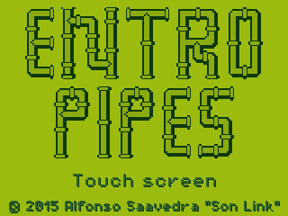
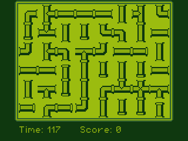

#EntroPipes

© 2015 - 2016 Alfonso Saavedra "Son Link"

http://son-link.github.io

EntroPipes is a puzzle type game programing on [LUA](http://lua.org) and the framework [LÖVE](http://love2D.org) for **Linux** and **Windows** and **Nintendo 3DS** thanks to [LövePotion](https://github.com/VideahGams/LovePotion)

For Nintendo 3DS you need a **flash cart** or a **Hax** *(Menuhax, BrowserHax, etc)*

Under **GPL 3** license

Based on original idea of [Z80St Software](https://sites.google.com/site/z80stsoftware)

## Instalation:

### Linux:
You need donwload **Löve** 0.9.0 or newer from official web and compile or, is avaliable, from the repositories of your GNU/Linux distro. For example on **Archlinux**: `pacman -S love`

Open a terminal and run `love path/to/EntroPipes.love` or `love path/to/EntroPipesFolder/`

Other trick is create a custom executable:

`cat /usr/bin/love EntroPipes.love > entropipes`

### Windows:
Simply download, unzip and double click on **EntroPipes.exe**

[32 bits](https://dl.dropboxusercontent.com/u/58286032/juegos/EntroPipes/EntroPipes-win32.zip)

[64 bits](https://dl.dropboxusercontent.com/u/58286032/juegos/EntroPipes/EntroPipes-win64.zip)

### Nintendo 3DS

[Download this zip](https://dl.dropboxusercontent.com/u/58286032/juegos/EntroPipes/EntroPipes-3ds.zip) and unzip on the root of your SD card

## How to play:

Simply click the pipe to rotate.
Press **Start** on Nintendo 3DS or **Enter** on Linux/Windows to pause game

Press **X** on Nintendo 3DS to return to the Homebrew Launcher

Press **Scape** on Linux/Windows to exit

## Captures:

## Puzzle editor:

The puzzle editor is write on HTML and Javascript, simply open **editor.html** on your favorite web browser (tested on **Firefox** and **Chrome**) or use the online versions avaliable on my [blog](http://son-link.github.io/entropipes_editor/) and send to my email account, or create a new issue or send push merge.

## Other credits:

**LövePotion:** Licensed under the MIT Open Source License.
Copyright (c) 2015 Ruairidh Carmichael - ruairidhcarmichael@live.co.uk

**PixelOperator:**
(C) 2009-2015 The Grandoplex Project.
Made in Al Khobar, Saudi Arabia.
This font by Jayvee Enaguas (HarvettFox96) is licensed under
the SIL OFL 1.1 <http://scripts.sil.org/OFL>.
[Download page](http://harvettfox96.deviantart.com/art/Pixel-Operator-1-5-0-568359556)

Font icon for the editor make with [Fontello](http://fontello.com)